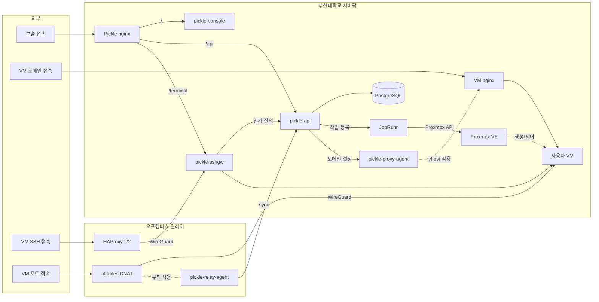

# pickle-image-builder

부산대학교 클라우드 플랫폼(Pickle)의 사용자 VM OS 이미지를 만드는 빌드 레시피입니다.

사용자 VM은 Proxmox 템플릿을 전체 복제해 만듭니다. 이 저장소는 그 템플릿의 재료를
담습니다. 업스트림 클라우드 이미지에 무엇을 더하고 무엇을 덜어낼지, 배포판마다 무엇이
다른지가 여기에 있습니다. 빌드는 운영자가 하이퍼바이저 호스트에서 실행하고, 만들어진
템플릿은 플랫폼의 OS 카탈로그가 가리킵니다.

## 동작 방식

- **빌더 하나에 OS마다 프로파일 하나** — 배포판 차이는 코드 분기가 아니라
  `profiles/`의 값입니다. 프로파일이 표현할 수 있는 범위 안에서는 OS를 추가하는
  일이 파일 하나를 더 놓는 일입니다. 그 범위를 벗어나는 차이를 만나면 항목을 하나
  늘리고 빌더가 그 항목을 읽게 하는 것이 원래 방식입니다.
- **프로파일은 격리해 읽습니다.** 프로파일은 셸 파일이고 빌더는 하이퍼바이저에서
  root로 돌기 때문에, 빈 환경의 하위 셸에서 실행해 정해진 항목만 가져옵니다.
  프로파일이 무엇을 대입하든 빌더의 VMID나 재빌드 여부에는 닿지 않습니다.
- **업스트림 이미지는 릴리스 채널에서 받습니다.** 특정 빌드를 고정하지 않으므로
  다시 빌드하면 그동안 쌓인 보안 수정이 함께 들어옵니다.
- **체크섬은 매 빌드마다 대조합니다.** 내려받을 때 한 번이 아니라 캐시된 사본도
  같이 확인합니다. 존재만 확인하는 캐시는 릴리스 채널이 이미지를 다시 올린 뒤에도
  옛 사본을 계속 구우면서 성공으로 보고합니다. 다만 체크섬은 이미지와 같은 호스트가
  같은 TLS로 내려주므로, 이 대조가 잡는 것은 낡은 캐시이지 공급망이 아닙니다.
- **작업 사본을 고칩니다.** 검증된 원본은 캐시에 남겨 다음 빌드가 다시 내려받지
  않게 하고, 커스터마이즈는 복사본에서만 일어납니다.
- **기존 템플릿은 마지막에 지웁니다.** 내려받기와 검증, 이미지 커스터마이즈가 모두
  끝난 뒤에야 옛 VMID를 지우므로, 도중에 실패한 재빌드는 노드에 있던 템플릿을
  그대로 남깁니다.
- **VMID는 템플릿 대역만 받습니다.** 대역을 벗어난 값은 무엇이 실행되기도 전에
  거부합니다.
- **다시 빌드할 때 지우는 것은 같은 이름의 게스트뿐입니다.** 그 자리에 다른 이름의
  게스트가 있으면 멈춥니다. VMID를 잘못 적는 일은 다른 어떤 사고보다 흔하고,
  파기는 백업과 복제 작업까지 함께 가져갑니다. 존재만 확인하고 넘어가면 디스크 없이
  만들어진 VM이 정상 템플릿으로 복제되기도 합니다.
- **한 번에 한 빌드만 돕니다.** 동시에 돌면 같은 내려받기 경로를 두고 겹칩니다.
- **빌드마다 매니페스트를 남깁니다.** 템플릿은 자기 재료를 기록하지 않아서, 번호와
  이름만으로는 어떤 업스트림 이미지가 들어갔는지 알 수 없습니다. `manifests/`에
  템플릿 번호마다 파일 하나를 두어 한참 뒤에도 되짚을 수 있게 합니다.
- **게스트 계정은 클라우드 이미지의 기본 사용자를 그대로 씁니다.** 플랫폼도 같은
  이름을 cloud-init에 넘기므로 템플릿 혼자 정하는 값이 아닙니다.
- **템플릿에 host key를 남기지 않습니다.** 남기면 모든 클론이 같은 키를 쓰게 되고,
  플랫폼이 VM마다 키를 수집해 고정하는 구조라 겉으로는 멀쩡해 보이면서 실제로는
  아무것도 보호하지 않습니다. 빌드가 키가 없는지 확인하고 끝냅니다.
- **sshd 설정은 파일이 아니라 실효값을 확인합니다.** 문법 검사는 드롭인이 읽혔는지
  말해 주지 않습니다. `Include`가 없거나 자기 설정 뒤에 오는 배포판에서는 문법이
  멀쩡한 채로 우리 값이 하나도 적용되지 않습니다.
- **부팅이 막힌 VM에 들어갈 길을 남깁니다.** 클라우드 이미지는 GRUB 메뉴를 숨기는데,
  sshd가 뜨지 않는 VM은 웹 터미널로도 못 들어갑니다(그쪽도 SSH입니다). 시리얼
  콘솔에 3초짜리 메뉴를 띄워 두면 fstab이나 sudoers를 망가뜨린 VM을 콘솔에서
  살릴 수 있습니다.
- **패키지 관리가 사람을 붙잡지 않게 합니다.** 설정 파일 충돌 물음이 뜨면 자동
  업데이트가 dpkg를 물린 채 멈추고, 재시작할 서비스를 묻는 전체 화면 프롬프트는
  학생이 `apt install`을 칠 때마다 나타납니다. 갓 만들어진 게스트는 정기 작업의
  이전 기록이 없어서 첫 로그인 중에 그 작업이 몰려 실행되기도 합니다.
- **작은 게스트가 감당할 수 없는 기본값을 조입니다.** 감시 파일 수 상한은 메모리에서
  계산돼 만오천 언저리에 놓이는데, 편집기의 원격 세션이나 파일을 지켜보는 빌드가 그걸
  넘기면서 원인을 알려 주지 않는 오류를 냅니다. 패닉난 커널은 재부팅 타이머가 꺼져
  있어 그대로 죽어 있고, 저널과 코어 덤프는 각각 파일시스템의 10분의 1까지 쓸 수
  있습니다.
- **첫 부팅에 패키지 업그레이드를 돌리지 않습니다.** Proxmox가 기본으로 켜 두는
  동작인데, 측정해 보면 부팅의 절반을 차지하고 그동안 게스트 에이전트가 응답하지
  않습니다. 플랫폼이 그 시간에 게스트의 host key를 수집합니다. 보안 갱신은 이미지
  안의 자동 업데이트가 게스트 자신의 일정으로 처리합니다.

## 시작하기

```
scripts/setup-hooks.sh    # 커밋 훅 설치 (클론 후 한 번)
scripts/verify.sh         # shellcheck + 위생 검사 + 프로파일 검사

scripts/build.sh <프로파일> <vmid>             # 템플릿 빌드
scripts/build.sh <프로파일> <vmid> --rebuild   # 기존 VMID를 지우고 다시 빌드
```

빌드는 Proxmox 노드에서 root로 실행합니다. `curl`, `flock`, `git`, `qm`이 필요하고
`libguestfs-tools`가 없으면 설치합니다. 캐시가 이미 있어도 체크섬을 받아야 하므로
**매 빌드마다 업스트림에 접근할 수 있어야 합니다**. 인자 없이 실행하면 사용법과 가진
프로파일 목록을 출력합니다.

빌드가 남기는 것은 캐시 디렉터리의 검증된 원본 이미지와 잠금 파일입니다. 프로파일이
릴리스 채널을 가리키면 파일 이름이 그대로라 덮어쓰이고, 특정 빌드를 가리키면 하나씩
쌓입니다. `--rebuild`는 `qm destroy --purge`를 쓰므로 그 VMID의 백업과 복제
작업도 함께 사라집니다.

새 프로파일에는 `# shellcheck shell=bash` 줄이 필요합니다. 없으면 `verify.sh`의 셸
린트가 거부합니다.

빌드가 끝나면 `manifests/<프로파일>-<vmid>.json`이 갱신됩니다. 실제로 쓰는 템플릿을
만들었다면 이 파일을 그 빌드의 커밋에 함께 담고, 시험 삼아 만든 것이라면 템플릿과 같이
지웁니다. 담기는 값은 업스트림 이미지 주소와 체크섬, 설치한 패키지, 레시피 리비전,
빌드 시각입니다. 작업 트리에 커밋하지 않은 변경이 있으면 리비전 뒤에 표시가 붙습니다.

`verify.sh`는 커밋 전마다 실행합니다. 셸 린트에 더해 공개 저장소 규칙을 검사하고,
프로파일을 빌더와 똑같은 방식으로 읽어 같은 규칙으로 검사하고, IPv4 주소 리터럴이
문서화 대역(RFC 5737)이나 루프백처럼 어느 호스트도 가리키지 않는 값이 아니면
실패합니다.

## 구성

빌드할 때 환경 변수로 덮어쓸 수 있는 값입니다.

| 변수 | 기본값 | 설명 |
|---|---|---|
| `STORAGE` | `local-lvm` | 템플릿 디스크를 올릴 Proxmox 스토리지 |
| `BRIDGE` | `vmbr2` | `net0`에 붙일 브리지 |
| `IMAGE_CACHE_DIR` | `/var/cache/pickle-image-builder` | 업스트림 이미지 캐시 위치 |

프로파일이 담는 값입니다. 선택 표시가 없는 항목이 비어 있으면 `verify.sh`와 빌더가
모두 거부합니다.

| 항목 | 설명 |
|---|---|
| `OS_FAMILY` / `OS_VERSION` | OS 카탈로그가 쓰는 계열과 버전 |
| `TEMPLATE_NAME` | 템플릿 이름 |
| `IMAGE_URL` / `CHECKSUM_URL` / `CHECKSUM_ALGO` | 업스트림 이미지와 그 체크섬 |
| `CIUSER` | 게스트 관리 계정 (클라우드 이미지의 기본 사용자). 환경 변수로 덮어쓸 수 없습니다 |
| `SUDO_GROUP` | sudo 권한을 주는 그룹. 규칙이 계정이 아니라 그룹을 가리키므로 계정명이 달라져도 규칙이 살아 있습니다. 빌드가 그 그룹이 이미지에 실제로 있는지 확인합니다 |
| `CPU_TYPE` | 템플릿 CPU 모델. ISA 하한을 올린 배포판은 더 높은 값이 필요합니다 |
| `GUEST_PACKAGES` | 이미지에 설치할 패키지. 쉼표로 구분합니다 |
| `SSHD_DROPIN_REMOVE` | (선택) 배포판이 넣어 둔 sshd 드롭인 중 지울 것 |
| `CHECKSUM_FORMAT` | (선택) `gnu`(기본) 또는 `bsd`. Red Hat 계열은 `SHA256 (파일) = 해시` 형식입니다 |

## 전체 아키텍처



| 저장소 | 역할 |
|---|---|
| [pickle-api](https://github.com/PNUops/pickle-api) | REST API와 프로비저닝 워커 (Spring Boot 4, Java 25, PostgreSQL 18, JobRunr) |
| [pickle-console](https://github.com/PNUops/pickle-console) | 사용자·관리자 웹 콘솔 (React 19, TypeScript) |
| [pickle-sshgw](https://github.com/PNUops/pickle-sshgw) | SSH 게이트웨이와 웹 터미널 브리지 (sshpiperd, Go) |
| [pickle-proxy-agent](https://github.com/PNUops/pickle-proxy-agent) | nginx 리버스 프록시 제어 에이전트 (Go) |
| [pickle-relay-agent](https://github.com/PNUops/pickle-relay-agent) | 오프캠퍼스 릴레이의 nftables DNAT 에이전트 (Go) |
| [pickle-image-builder](https://github.com/PNUops/pickle-image-builder) | 사용자 VM OS 이미지 빌드 레시피 (shell, virt-customize) |
| [pickle-infra](https://github.com/PNUops/pickle-infra) (비공개) | 인프라 프로비저닝 스크립트와 운영 런북 (shell) |
| [pickle-infra-example](https://github.com/PNUops/pickle-infra-example) | 프로비저닝·배포 스크립트와 런북 샘플 |
| [pickle-secrets](https://github.com/PNUops/pickle-secrets) (비공개) | 호스트 시크릿 볼트 (git-crypt) |
| [pickle-secrets-example](https://github.com/PNUops/pickle-secrets-example) | 볼트 레이아웃과 git-crypt 운용 절차 |
