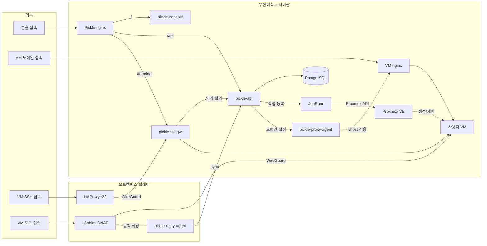

# pickle-image-builder

부산대학교 클라우드 플랫폼(Pickle)의 사용자 VM OS 이미지를 만드는 빌드 레시피입니다.

사용자 VM은 Proxmox 템플릿을 전체 복제해 만듭니다. 이 저장소는 그 템플릿의 재료를
담습니다. 업스트림 클라우드 이미지에 무엇을 더하고 무엇을 덜어낼지, 배포판마다 무엇이
다른지가 여기에 있습니다. 빌드는 운영자가 하이퍼바이저 호스트에서 실행하고, 만들어진
템플릿은 플랫폼의 OS 카탈로그가 가리킵니다.

현재는 검증 도구와 커밋 훅만 들어 있습니다. 빌더와 OS 프로파일은 아직 제공하지
않습니다.

## 시작하기

```
scripts/setup-hooks.sh   # 커밋 훅 설치 (클론 후 한 번)
scripts/verify.sh        # shellcheck + 공개 위생 검사 + 주소 검사
```

`verify.sh`는 커밋 전마다 실행합니다. 셸 린트에 더해 공개 저장소 규칙을 검사하고,
IPv4 주소 리터럴이 문서화 대역(RFC 5737) 밖이면 실패합니다. 배포 환경의 주소는 빌드
변수로 받으며 저장소에 두지 않습니다.

## 전체 아키텍처



| 저장소 | 역할 |
|---|---|
| [pickle-api](https://github.com/PNUops/pickle-api) | REST API와 프로비저닝 워커 (Spring Boot 4, Java 25, PostgreSQL 18, JobRunr) |
| [pickle-console](https://github.com/PNUops/pickle-console) | 사용자·관리자 웹 콘솔 (React 19, TypeScript) |
| [pickle-sshgw](https://github.com/PNUops/pickle-sshgw) | SSH 게이트웨이와 웹 터미널 브리지 (sshpiperd, Go) |
| [pickle-proxy-agent](https://github.com/PNUops/pickle-proxy-agent) | nginx 리버스 프록시 제어 에이전트 (Go) |
| [pickle-relay-agent](https://github.com/PNUops/pickle-relay-agent) | 오프캠퍼스 릴레이의 nftables DNAT 에이전트 (Go) |
| [pickle-image-builder](https://github.com/PNUops/pickle-image-builder) | 사용자 VM OS 이미지 빌드 레시피 (shell, virt-customize) |
| [pickle-infra](https://github.com/PNUops/pickle-infra) (비공개) | 인프라 프로비저닝 스크립트와 운영 런북 (shell) |
| [pickle-infra-example](https://github.com/PNUops/pickle-infra-example) | 프로비저닝·배포 스크립트와 런북 샘플 |
| [pickle-secrets](https://github.com/PNUops/pickle-secrets) (비공개) | 호스트 시크릿 볼트 (git-crypt) |
| [pickle-secrets-example](https://github.com/PNUops/pickle-secrets-example) | 볼트 레이아웃과 git-crypt 운용 절차 |
