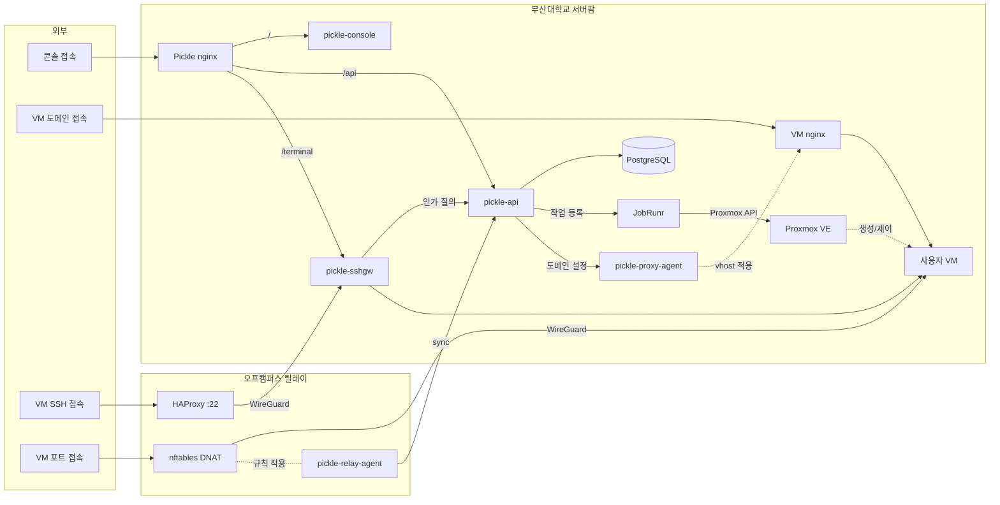

# pickle-image-builder

부산대학교 클라우드 플랫폼(Pickle)의 사용자 VM OS 이미지를 만드는 빌드 레시피입니다.

사용자 VM은 Proxmox 템플릿을 전체 복제해 만듭니다. 이 저장소는 그 템플릿의 재료를
담습니다. 업스트림 클라우드 이미지에 무엇을 더하고 무엇을 덜어낼지, 배포판마다 무엇이
다른지가 여기에 있습니다. 빌드는 운영자가 하이퍼바이저 호스트에서 실행하고, 만들어진
템플릿은 플랫폼의 OS 카탈로그가 가리킵니다.

## 동작 방식

- **빌더 하나에 OS마다 프로파일 하나** — 배포판 차이는 코드 분기가 아니라
  `profiles/`의 값입니다. OS를 추가하는 일은 프로파일 파일 하나를 더 놓는
  일입니다.
- **프로파일은 격리해 읽습니다.** 프로파일은 셸 파일이고 빌더는 하이퍼바이저에서
  root로 돌기 때문에, 빈 환경의 하위 셸에서 실행해 정해진 항목만 가져옵니다.
  프로파일이 무엇을 대입하든 빌더의 VMID나 재빌드 여부에는 닿지 않습니다.
- **업스트림 이미지는 릴리스 채널에서 받습니다.** 특정 빌드를 고정하지 않으므로
  다시 빌드하면 그동안 쌓인 보안 수정이 함께 들어옵니다.
- **체크섬은 매 빌드마다 대조합니다.** 내려받을 때 한 번이 아니라 캐시된 사본도
  같이 확인합니다. 존재만 확인하는 캐시는 릴리스 채널이 이미지를 다시 올린 뒤에도
  옛 사본을 계속 구우면서 성공으로 보고합니다.
- **작업 사본을 고칩니다.** 검증된 원본은 캐시에 남겨 다음 빌드가 다시 내려받지
  않게 하고, 커스터마이즈는 복사본에서만 일어납니다.
- **기존 템플릿은 마지막에 지웁니다.** 내려받기와 검증, 이미지 커스터마이즈가 모두
  끝난 뒤에야 옛 VMID를 지우므로, 도중에 실패한 재빌드는 노드에 있던 템플릿을
  그대로 남깁니다.
- **VMID는 템플릿 대역만 받습니다.** 대역을 벗어난 값은 무엇이 실행되기도 전에
  거부합니다. 그 자리에 템플릿이 아닌 VM이 있으면 조용히 넘어가지 않고 멈춥니다.
  존재만 확인하고 넘어가면 디스크 없이 만들어진 VM이 정상 템플릿으로 복제됩니다.
- **한 번에 한 빌드만 돕니다.** 동시에 돌면 같은 내려받기 경로를 두고 겹칩니다.
- **게스트 계정은 클라우드 이미지의 기본 사용자를 그대로 씁니다.** 플랫폼도 같은
  이름을 cloud-init에 넘기므로 템플릿 혼자 정하는 값이 아닙니다.

## 시작하기

```
scripts/setup-hooks.sh                    # 커밋 훅 설치 (클론 후 한 번)
scripts/verify.sh                         # shellcheck + 위생 검사 + 프로파일 검사
scripts/build.sh <프로파일> <vmid>         # 템플릿 빌드
scripts/build.sh <프로파일> <vmid> --rebuild   # 기존 VMID를 지우고 다시 빌드
```

빌드는 Proxmox 노드에서 root로 실행합니다. `libguestfs-tools`가 없으면 설치합니다.
인자 없이 실행하면 사용법과 가진 프로파일 목록을 출력합니다.

`verify.sh`는 커밋 전마다 실행합니다. 셸 린트에 더해 공개 저장소 규칙을 검사하고,
프로파일이 필수 항목을 빠뜨렸는지 확인하며, IPv4 주소 리터럴이 문서화 대역(RFC 5737)
밖이면 실패합니다. 배포 환경의 주소는 빌드 변수로 받으며 저장소에 두지 않습니다.

## 구성

빌드할 때 환경 변수로 덮어쓸 수 있는 값입니다.

| 변수 | 기본값 | 설명 |
|---|---|---|
| `STORAGE` | `local-lvm` | 템플릿 디스크를 올릴 Proxmox 스토리지 |
| `BRIDGE` | `vmbr2` | `net0`에 붙일 브리지 |
| `IMAGE_CACHE_DIR` | `/var/lib/vz/template/iso` | 업스트림 이미지 캐시 위치 |
| `TEMPLATE_NAME` | 프로파일 값 | 만들 템플릿의 이름 |

프로파일이 담는 값입니다. 하나라도 빠지면 `verify.sh`와 빌더가 모두 거부합니다.

| 항목 | 설명 |
|---|---|
| `OS_FAMILY` / `OS_VERSION` | OS 카탈로그가 쓰는 계열과 버전 |
| `TEMPLATE_NAME` | 템플릿 이름 |
| `IMAGE_URL` / `CHECKSUM_URL` / `CHECKSUM_ALGO` | 업스트림 이미지와 그 체크섬 |
| `CIUSER` | 게스트 관리 계정 (클라우드 이미지의 기본 사용자). 환경 변수로 덮어쓸 수 없습니다 |
| `CPU_TYPE` | 템플릿 CPU 모델. ISA 하한을 올린 배포판은 더 높은 값이 필요합니다 |
| `GUEST_PACKAGES` | 이미지에 설치할 패키지. 쉼표로 구분합니다 |
| `SSHD_DROPIN_REMOVE` | 배포판이 넣어 둔 sshd 드롭인 중 지울 것 (선택) |

## 전체 아키텍처



| 저장소 | 역할 |
|---|---|
| [pickle-api](https://github.com/PNUops/pickle-api) | REST API와 프로비저닝 워커 (Spring Boot 4, Java 25, PostgreSQL 18, JobRunr) |
| [pickle-console](https://github.com/PNUops/pickle-console) | 사용자·관리자 웹 콘솔 (React 19, TypeScript) |
| [pickle-sshgw](https://github.com/PNUops/pickle-sshgw) | SSH 게이트웨이와 웹 터미널 브리지 (sshpiperd, Go) |
| [pickle-proxy-agent](https://github.com/PNUops/pickle-proxy-agent) | nginx 리버스 프록시 제어 에이전트 (Go) |
| [pickle-relay-agent](https://github.com/PNUops/pickle-relay-agent) | 오프캠퍼스 릴레이의 nftables DNAT 에이전트 (Go) |
| [pickle-image-builder](https://github.com/PNUops/pickle-image-builder) | 사용자 VM OS 이미지 빌드 레시피 (shell, virt-customize) |
| [pickle-infra](https://github.com/PNUops/pickle-infra) (비공개) | 인프라 프로비저닝 스크립트와 운영 런북 (shell) |
| [pickle-infra-example](https://github.com/PNUops/pickle-infra-example) | 프로비저닝·배포 스크립트와 런북 샘플 |
| [pickle-secrets](https://github.com/PNUops/pickle-secrets) (비공개) | 호스트 시크릿 볼트 (git-crypt) |
| [pickle-secrets-example](https://github.com/PNUops/pickle-secrets-example) | 볼트 레이아웃과 git-crypt 운용 절차 |
